# src/net — the TCP transport

The classes here split along two axes. **Client vs server**: the client side turns `craft_replica` verbs
into wire messages (`CraftTcpReplica` and the connections under it); the server side decodes them and
drives the reference model (`craft_tcp_server`, `craft_cluster_server`). **Blocking vs on-ring**: the
admin plane (LOGIN/LOGOUT, and any verb called with a null `q`) runs blocking round-trips on the one
process-wide session-mgr thread via `wire_client`; the data plane (a verb whose leading `q` names a
caller-owned io_uring) fans out on `craft_async_conn`, many ops in flight, replies demuxed by
`request_id`. Every box speaks the `craft/wire.hpp` codec; those edges are omitted below to keep the
picture readable.

```mermaid
classDiagram
    direction TB

    %% ── the engine seam: what craft_client programs against ──
    class craft_replica {
        <<interface>>
        +login(client_token)
        +logout(hdr)
        +write(q, hdr, dlsn, addr, len, data)
        +read(q, hdr, read_lsn, addr, len, dest)
        +keep_alive(q, hdr)
        +request_resolution(q, hdr, upto)
        +id() peer_id_t
    }

    class io_uring {
        <<caller-owned ring: a ublk hw queue's, or a test's>>
    }

    namespace PublicSurface {
        class tcp_cluster {
            <<opaque handle, craft/tcp.hpp>>
            +backends() craft_replica shared_ptrs
        }
        class craft_conn {
            <<blocking io_uring TCP conn>>
            +connect(host, port, timeout)$
            +adopt(fd)$
            +send_all(data) bool
            +recv_message(max_tx, timeout, dg)
            -fd_ int
            -ring_ its OWN ring, submit-and-wait
        }
        class craft_listener {
            +bind_listen(port)$
            +accept() craft_conn
            +port() uint16_t
        }
        class net_error {
            <<enumeration>>
            setup, connect, send, recv
            closed, malformed
            invalid_argument, timed_out
        }
    }

    namespace ClientSide {
        class CraftTcpReplica {
            <<the adapter: craft_replica over the wire>>
            +shutdown() drain in-flight ops
            -hop() resume on mgr thread
            -conn_for(q) slot lookup or append
            -ensure_connected() ensure_bound(term)
            -on_net_fault(e) poison + map to domain
            -rt_read_ rt_write_ rt_keepalive_ rt_stat
        }
        class wire_client {
            <<blocking, wire-only>>
            +connect(host, port, timeout)$
            +login(volume_id, client_token)
            +helo(volume_id, client_token, term)
            +logout()
            +write read keep_alive resolve
            +set_op_timeout(t)
        }
        class craft_async_conn {
            <<on-ring data path, many ops in flight>>
            +ensure_ready(vol, token, term)
            +write read keep_alive resolve
            +shutdown() after ring quiesce
            -run_pump() persistent recv, demux by request_id
            -round_trip(op, hdr, body)
            -pending_ request_id to reply_slot
        }
        class craft_session_mgr {
            <<one process-wide admin thread>>
            +get()$ refcounted
            +post(job)
            +drain() FIFO fence
            +on_mgr_thread() bool
        }
        class reply_values {
            <<value structs, wire_client.hpp>>
            login_result
            lsn_reply
            read_reply
            resolve_reply
        }
    }

    namespace ServerSide {
        class craft_tcp_server {
            <<one replica over TCP>>
            +serve(conn) blocking loop
            +log_stats()
            -on_login .. on_resolve dispatch
        }
        class server_geometry {
            capacity, lba_size, max_tx
            members
        }
        class craft_cluster_server {
            <<one process fronting the whole set>>
            +start() +stop()
            +members() port(idx) leader_index() volume_id()
            +set_replica_up(idx, up)
            +force_subquorum(keep_idx)
            +set_delay(idx, d) straggler knob
            +journal_slots replica_term read_replica
        }
    }

    namespace TestHarness {
        class TcpReplicaSet {
            <<tcp_set.hpp>>
            +server
            +replicas index 0 leads
            teardown: shutdown proxies, then server stop
        }
    }

    namespace ReferenceModel {
        class MemCraftReplica {
            <<src/mem: the modeled replica>>
            srv_ local-server seam
        }
        class MemReplicaGroup {
            +net MemTransport
            +replicas
        }
        class MemTransport {
            <<in-process net + login cold path>>
            run_login run_logout
            fault_state knobs
        }
    }

    craft_replica <|.. CraftTcpReplica : implements (over the wire)
    craft_replica <|.. MemCraftReplica : implements (in process)

    tcp_cluster o-- "N" CraftTcpReplica : proxies_ / backends()
    TcpReplicaSet o-- "1" craft_cluster_server : server
    TcpReplicaSet o-- "N" CraftTcpReplica : replicas

    CraftTcpReplica *-- "1" wire_client : conn_ (admin + null-q tier, mgr thread only)
    CraftTcpReplica o-- "1" craft_session_mgr : mgr_ (shared by every proxy in the process)
    CraftTcpReplica *-- "0..64" craft_async_conn : slots_ (one per caller ring, lazy)
    CraftTcpReplica ..> net_error : on_net_fault() maps to domain error

    wire_client *-- "1" craft_conn : conn_
    wire_client ..> reply_values : returns
    craft_async_conn ..> reply_values : returns (same types)
    craft_async_conn --> io_uring : ring_ (borrowed, every SQE goes here)

    craft_listener ..> craft_conn : accept() yields

    craft_tcp_server *-- "1" server_geometry : geo_
    craft_tcp_server o-- "1" MemCraftReplica : replica_ (pimpl, in the .cpp)
    craft_tcp_server ..> craft_conn : serve(conn)

    craft_cluster_server *-- "1" MemReplicaGroup : pimpl wraps (in the .cpp)
    craft_cluster_server *-- "N" craft_listener : one loopback port per member
    craft_cluster_server ..> craft_conn : one serve thread per accepted conn

    MemReplicaGroup o-- "N" MemCraftReplica : replicas
    MemReplicaGroup o-- "1" MemTransport : net
```

## Reading the diagram

- **Entry points.** Production code never names a class in this directory: `craft/tcp.hpp`'s
  `make_tcp_cluster()` builds the opaque `tcp_cluster` (body in `tcp_cluster.cpp`), whose
  `backends()` are the `craft_replica` pointers handed to `make_client()`. Tests use
  `make_tcp_replica_set()` (`tcp_set.hpp`), which pairs the same proxies with an in-process
  `craft_cluster_server`.
- **The blk-mq grid.** Each `CraftTcpReplica` is one replica's column of the
  `nr_hw_queues x N` connection grid: one `craft_async_conn` per caller ring (`slots_`, appended on a
  ring's first verb, ring-owner-thread only) plus the one blocking `wire_client` admin socket. LOGIN
  rides the admin socket once, set-wide; every data socket HELOs into that session's term. See
  `docs/transport.md` for the full topology and lifecycle.
- **Ownership vs borrowing of rings.** `craft_conn` owns a private ring and does submit-and-wait
  (blocking, one op at a time). `craft_async_conn` owns no ring at all: it submits SQEs on the
  caller's `io_uring` and its ops complete on that ring owner's reap thread — that is what lets many
  requests sit in flight and complete out of order.
- **Coupling.** `craft_conn`, `wire_client`, and `craft_async_conn` are wire-only (no homeblocks
  header) — the embeddable reference-client tier. `CraftTcpReplica` is the one client-side coupled
  adapter (it implements `craft_replica`). The two servers keep coupling out of their headers via
  pimpl; only their `.cpp`s see the mem model.
- **Teardown order is load-bearing.** Drain every proxy (`CraftTcpReplica::shutdown()`, fencing the
  shared session-mgr queue) *before* dropping any of them; quiesce each caller ring before the slot
  dtors destroy their `craft_async_conn`s; stop the server last. `TcpReplicaSet::~TcpReplicaSet` and
  `~tcp_cluster` both encode exactly this sequence.

## File map

| File | Types | Role |
|---|---|---|
| `../../include/craft/net/conn.hpp` + `conn.cpp` | `craft_conn`, `craft_listener`, `net_error` | The installed P1 building block: a blocking io_uring TCP connection (own ring, submit-and-wait) and the loopback listener. Both sides build on it. |
| `wire_client.hpp/.cpp` | `wire_client`, `login_result`, `lsn_reply`, `read_reply`, `resolve_reply` | The blocking, wire-only reference client: session verbs (LOGIN/HELO/LOGOUT) plus blocking IO. Its reply structs are the shared vocabulary of both data paths. |
| `async_conn.hpp/.cpp` | `craft_async_conn` | The P2 on-ring data path: SQEs on the caller's ring, one persistent recv pump demuxing replies by `request_id`, send half serialized, connect+HELO lazy. |
| `session_mgr.hpp/.cpp` | `craft_session_mgr` | One process-wide admin thread shared by every proxy, refcounted — retires when the last proxy drops. |
| `tcp_replica.hpp/.cpp` | `CraftTcpReplica` | The client-side adapter: `craft_replica` over the wire. Bridges the blocking tier (hop to the mgr thread) and the on-ring tier (per-ring `slots_`), and maps `net_error` to domain errors. |
| `tcp_cluster.cpp` | `tcp_cluster` | Body of the opaque `craft/tcp.hpp` handle: owns the N proxies and their upcast `craft_replica` aliases. |
| `tcp_server.hpp/.cpp` | `craft_tcp_server`, `server_geometry` | A single replica served over TCP by driving `MemCraftReplica`'s `srv_*` seam. Header is homeblocks-free (pimpl). |
| `cluster_server.hpp/.cpp` | `craft_cluster_server` | One process fronting a whole N-replica set on N loopback ports (the P3 stand-in for N processes), wrapping `MemReplicaGroup` + `MemTransport`, with the fault/straggler knobs the transport tests drive. |
| `tcp_set.hpp` | `TcpReplicaSet`, `make_tcp_replica_set()` | Test bundle: cluster server + N proxies, with the teardown order encoded in its destructor. |

Companion docs: `docs/wire.md` (the bytes), `docs/transport.md` (connection/session behavior),
`docs/client-internals.md` (what sits above the `craft_replica` seam).
